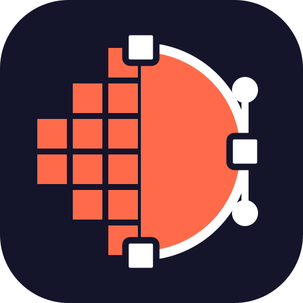
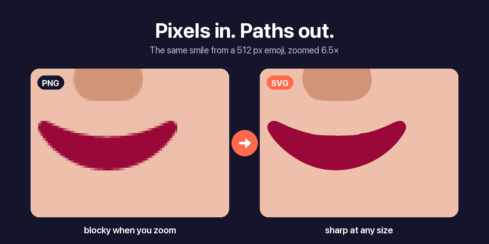
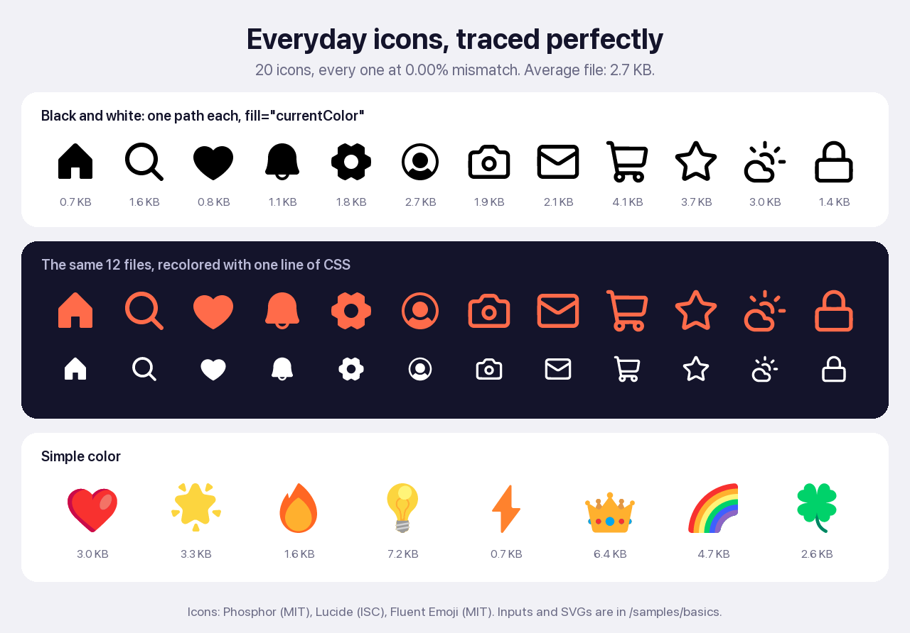
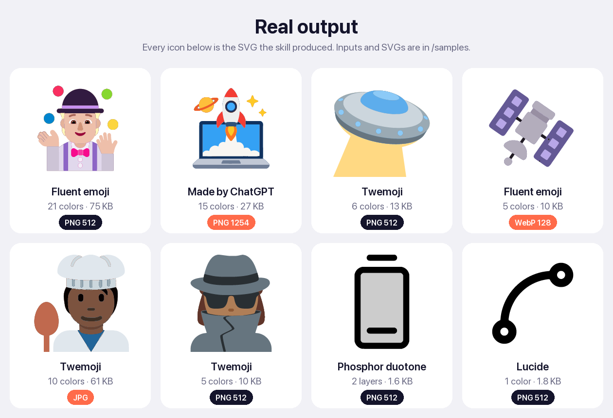
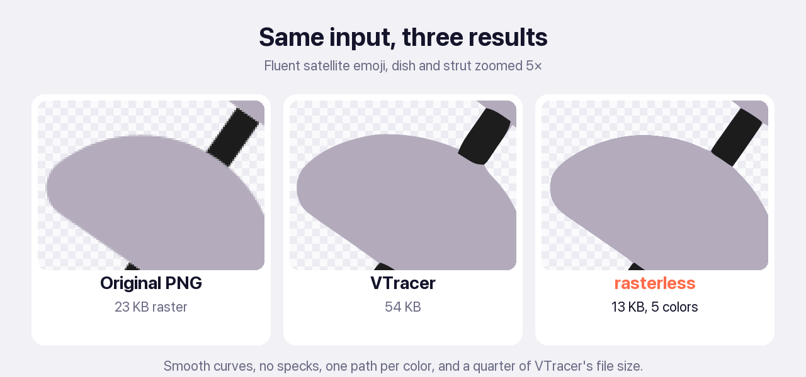
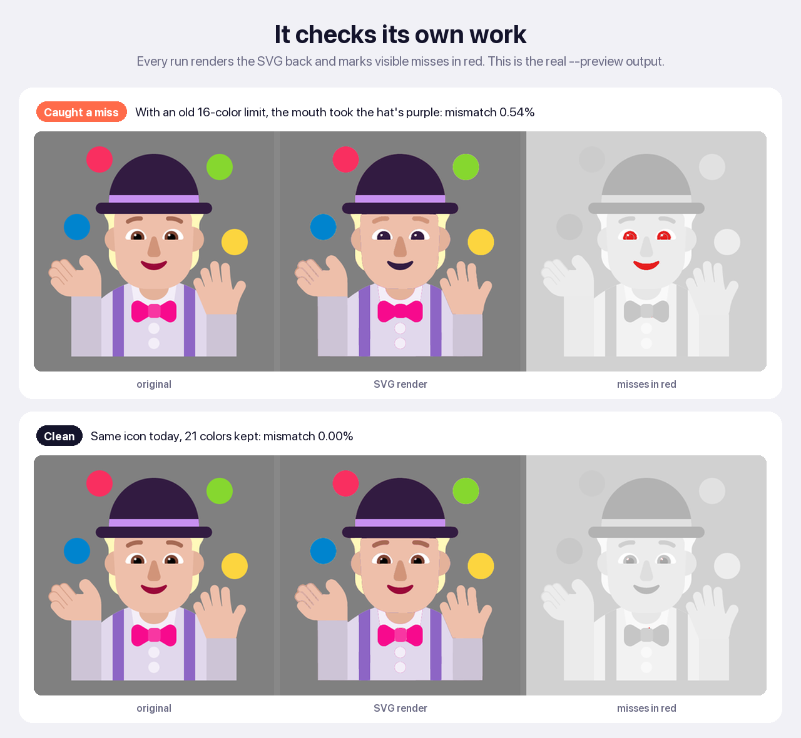
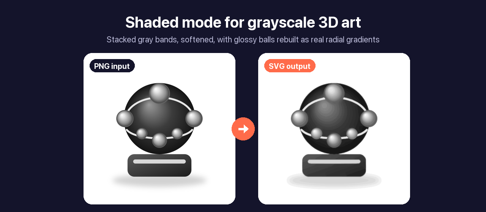

<p align="center">
  
</p>

<h1 align="center">rasterless</h1>

<p align="center"><b>PNG to SVG with AI.</b> Leave the pixels behind.</p>

<p align="center">
  Hand a PNG, JPG, or WebP icon, logo, or flat illustration to your AI and get back a small, layered SVG, checked against the original.
</p>

<p align="center">
  <a href="https://github.com/dheerajponnaganti/rasterless/releases/latest"></a>
  <a href="#install"></a>
  <a href="#install"></a>
  <a href="#install"></a>
  <a href="#install"></a>
  <a href="#install"></a>
  <a href="LICENSE"></a>
  
</p>

<p align="center">
  <a href="#see-it-work">Samples</a> ·
  <a href="#install">Install</a> ·
  <a href="#how-it-works">How it works</a> ·
  <a href="#benchmarks">Benchmarks</a> ·
  <a href="#faq">FAQ</a> ·
  <a href="#issues-and-ideas">Issues</a>
</p>

<p align="center">
  
</p>

## Why this exists

Most PNG to SVG converters were built for photos. On icons, logos, and flat art they produce jagged shapes, slightly wrong colors, specks along the edges, and files bigger than the PNG.

rasterless is built for flat graphics: icons, logos, emoji, and flat illustrations, plus grayscale 3D art in shaded mode.

- **One path per color.** A 6-color emoji becomes 6 layers.
- **True colors.** The palette comes from the flat insides of shapes, so anti-aliasing never turns into fake colors.
- **Sub-pixel edges.** The image is upscaled and snapped before tracing, so curves land between pixels where they belong.
- **No hairline gaps.** Layers overlap slightly, so the background never shows through a seam.
- **Self-check.** Every SVG is rendered back, compared with the input pixel by pixel, and the misses are drawn in red on a preview.
- **Small files.** On average a third the size of VTracer's output for the same icon.

## See it work

Everyday UI icons come out as one path each, a few KB in size, and recolor from CSS.

<p align="center">
  
</p>

Then the hard stuff: detailed emoji with up to 21 colors, a JPG, a tiny WebP, and an icon that ChatGPT drew.

<p align="center">
  
</p>

Every input and every SVG above is in [`samples/`](samples) and [`samples/basics/`](samples/basics). Open the SVGs, zoom in as far as you like, and diff them against the PNGs.

<p align="center">
  
</p>

### It checks its own work

Every conversion is drawn back and compared with the original. Anything visibly off is marked in red and counted. Below is a real miss the check caught, and the same icon after the fix.

<p align="center">
  
</p>

### Shaded art

Gray 3D-style illustrations get a second mode. The gray range is cut into stacked bands that can never leave gaps, the steps are softened with a light blur, and glossy balls are detected and rebuilt as real radial gradients fitted to the original.

<p align="center">
  
</p>

## Install

Works in Claude Code, Claude.ai, ChatGPT, Codex, Gemini CLI, and Cursor.

**Requirements:** Python 3.10 or newer on your own machine (Claude Code, Codex, Gemini CLI, Cursor, command line). [uv](https://docs.astral.sh/uv/) is recommended, since it installs the Python packages for you. Claude.ai and ChatGPT run it in their own sandbox, so you need nothing there.

<details open>
<summary><b>Claude Code</b></summary>

```
/plugin marketplace add dheerajponnaganti/rasterless
/plugin install rasterless@dheeraj-skills
```

To update later, run these in a terminal, or use the **Marketplaces** tab of `/plugin`:

```bash
claude plugin marketplace update dheeraj-skills
claude plugin update rasterless@dheeraj-skills
```
</details>

<details>
<summary><b>Any agent, one command</b></summary>

Works with Claude Code, Codex, Cursor, and 20+ other agents through the open [skills CLI](https://skills.sh):

```bash
npx skills add dheerajponnaganti/rasterless
```
</details>

<details>
<summary><b>Claude.ai</b></summary>

1. Download `rasterless.zip` from the [latest release](https://github.com/dheerajponnaganti/rasterless/releases/latest).
2. Open **Settings → Customize → Skills**, click **+ Add → Upload skill**, and pick the zip.
3. Make sure **Settings → Capabilities → Cloud code execution and file creation** is on. Skills need it.
</details>

<details>
<summary><b>ChatGPT</b></summary>

1. Download `rasterless.zip` from the [latest release](https://github.com/dheerajponnaganti/rasterless/releases/latest).
2. Open **Plugins → Skills → Add → Upload from your computer** and pick the zip. Your plan needs the Skills feature.
3. Switch to **Work** mode, attach an icon, type `@raster`, press <kbd>Tab</kbd> to pick **Rasterless**, and ask for the conversion.

To update, upload the new zip and choose **Replace existing**.
</details>

<details>
<summary><b>Codex</b></summary>

Ask Codex to install it with its built-in installer:

```
$skill-installer install https://github.com/dheerajponnaganti/rasterless/tree/main/skills/rasterless
```

Or copy it in by hand:

```bash
git clone https://github.com/dheerajponnaganti/rasterless
cp -R rasterless/skills/rasterless ~/.codex/skills/
```

Restart Codex, then ask for a conversion or call it directly with `$rasterless`. The first run downloads a few Python packages, so allow network access when Codex asks.
</details>

<details>
<summary><b>Gemini CLI</b></summary>

```bash
gemini extensions install https://github.com/dheerajponnaganti/rasterless
```

Restart Gemini CLI, then ask for a conversion. Gemini asks once before it activates the skill.
</details>

<details>
<summary><b>Cursor</b></summary>

Use the skills CLI from **Any agent, one command** above, or copy the skill into your personal skills folder:

```bash
git clone https://github.com/dheerajponnaganti/rasterless
cp -R rasterless/skills/rasterless ~/.cursor/skills/
```
</details>

<details>
<summary><b>Command line, no AI needed</b></summary>

Get the scripts:

```bash
git clone https://github.com/dheerajponnaganti/rasterless
cd rasterless
```

With uv, the Python packages install themselves on the first run. Without uv, run `pip install pillow numpy resvg-py` (add `opencv-python-headless scipy` for shaded mode) and use `python3` in place of `uv run`.

The commands and flags are listed [below](#commands).
</details>

### What to say to your AI

| You say | What it does |
|---|---|
| "make this png an svg" + the image | Converts with the defaults, checks the preview, and hands you the SVG |
| "convert every icon in `./icons` to svg" | Converts the whole folder into a folder of SVGs |
| "I need it for Figma" | Adds `--design`: exact hex colors, plus width and height |
| "keep the blue square behind it" | Adds `--keep-bg`, so the solid background stays as the bottom layer |
| "the mouth came out the wrong color" | Re-runs with `--colors N` set to the real number of colors |
| "this is a shaded gray illustration" | Switches to shaded mode (`rasterless_shaded.py`) |
| "the shading looks steppy" | Re-runs shaded mode with more bands, for example `--levels 32` |
| "the glossy balls look flat" | Re-runs shaded mode with `--spheres` |

### Commands

Prefix each command with `uv run skills/rasterless/scripts/` (or `python3 skills/rasterless/scripts/` after a `pip install`).

| Command | What it does |
|---|---|
| `rasterless.py logo.png` | Writes `logo.svg` next to `logo.png` |
| `rasterless.py logo.png -o brand/mark.svg` | Writes the SVG to a path you choose |
| `rasterless.py icons/*.png -o svg/` | Converts many files at once into the `svg/` folder |
| `rasterless.py logo.png --preview` | Also saves a side-by-side check image and prints where it is |
| `rasterless.py app-icon.png --keep-bg --design` | Keeps the colored square and writes exact colors for a design tool |
| `rasterless_shaded.py art.png --spheres --preview` | Shaded mode for grayscale 3D art, with glossy balls as real gradients |

### Flags

**`rasterless.py`** (flat icons)

| Flag | Default | What it does | Use it when |
|---|---|---|---|
| `-o PATH` | next to the input | Output file, or a folder when you pass several inputs | You want the SVG somewhere else |
| `--preview` | off | Saves a PNG with three panels: original, SVG render, and mismatches in red | You want to see the result before trusting it |
| `--colors N` | auto, up to 24 | Forces exactly N colors. Can go above 24 | Two shades merged, a near-duplicate color appeared, or a tiny feature took a neighbor's color |
| `--keep-bg` | off | Keeps a solid background as the bottom layer instead of dropping it | App icons that sit on a colored square |
| `--design` | off | Exact hex colors everywhere, plus `width` and `height` | Figma, Illustrator, Sketch, or print |

**`rasterless_shaded.py`** (grayscale 3D art)

| Flag | Default | What it does | Use it when |
|---|---|---|---|
| `-o PATH` | next to the input | Output file, or a folder for several inputs | You want the SVG somewhere else |
| `--preview` | off | Saves the same three-panel check image | Always a good idea for shaded art |
| `--levels N` | 20 | Number of gray bands. More is smoother and bigger | Steps are visible (try 28 to 32) or the file is too big (try 12) |
| `--blur S` | 1 | Softens the steps between bands, in pixels. `0` gives hard bands | `0` for design tools, `1.5` to `2` for softer shading |
| `--spheres` | off | Finds round glossy balls and redraws them as real radial gradients | The art has shiny spheres, nodes, or buttons |

### Reading the result line

Every file prints one line:

```
juggler.svg: 21 colors [#eebfaa #321b41 ...], 3476 segments, 75.0 KB, mismatch 0.00%, preview /tmp/.../juggler.preview.png
```

| Part | Meaning |
|---|---|
| `21 colors [...]` | How many color layers, and their hex values. `mono` means a single color. `#000000@20%` is a see-through layer |
| `3476 segments` | Curve and line pieces across all paths. Fewer means a simpler drawing |
| `75.0 KB` | Size of the SVG file |
| `mismatch 0.00%` | Share of pixels that visibly differ when the SVG is drawn back. Under 0.5% is a pass |
| `preview ...` | Where the three-panel check image was saved (only with `--preview`) |
| `WARNING: ...` | The image has gradients or shading, so flat bands were used. Read the FAQ on gradients |
| `not verified` | The checker library (`resvg-py`) is missing, so the SVG was written without the check |

Shaded mode prints the same idea: `orbs.svg: shaded, 24 gray bands, 5 spheres, 243.0 KB, mismatch 0.21%`.

## How it works


A few details that make the difference:

- **Edge pixels are blends.** A pixel halfway between black and yellow is assigned to whichever end it is closer to, so no thin sliver of a third color appears between two shapes.
- **Thin details are rescued.** A 1 px line never has a flat interior, so it would be missed. Colors that cannot be explained as a blend of two known colors are added back.
- **JPEG noise is ignored, near-whites are not.** Lossy inputs merge colors generously. Clean inputs use a finer setting, so an off-white cloud, an off-white rocket, and a white page stay three different things.
- **The background is what touches the edge.** White teeth inside a smiley on a white JPG stay as a shape. The white page around it goes.

## Benchmarks

96 icons from 12 open icon packs, each saved four ways, for 384 inputs. The converter was tuned on a separate set of icons, then checked on these. A pass means under 0.5% of pixels visibly wrong against the original vector.

| Input | rasterless | VTracer (default) |
|---|:---:|:---:|
| PNG, 512 px | **100%** | 90.6% |
| JPG on white | **99.0%** | 96.9% |
| WebP, 128 px | **83.3%** | 0% |
| PNG, 48 px | **62.5%** | 0% |
| Average file size | **9.8 KB** | 31.0 KB |

Small inputs lose details the pixels no longer carry. For the best result, feed it 256 px or more.

## FAQ

<details>
<summary><b>Will a one-color icon follow my CSS color?</b></summary>

Yes. A dark single-color icon is written with `fill="currentColor"`, so `color: red` recolors it. Duotone icons keep their lighter layer's opacity. Use `--design` if you want hard-coded hex colors instead.
</details>

<details>
<summary><b>Can I use the output in React?</b></summary>

Import it with SVGR or use it as an ``. If you paste the markup into JSX by hand, rename `fill-rule` to `fillRule`.
</details>

<details>
<summary><b>What about gradients?</b></summary>

Color icons with gradients are approximated with flat bands, and the converter warns you when it happens. For well-known brand logos, grab the official SVG from the brand's press page instead. Grayscale shaded art has its own mode, shown above.
</details>

<details>
<summary><b>Which images does it not handle well?</b></summary>

It is built for flat art: solid fills and crisp edges. These come out poorly, and it tells you so:

- **Photos and camera shots.** Millions of colors and soft edges have no clean vector form. You would get flat blotches and a file bigger than the photo.
- **Color illustrations with gradients, lighting, or texture.** Smooth color shading becomes flat bands, and the converter prints a warning. Shaded mode exists only for grayscale art.
- **Tiny, detailed icons.** Below about 64 px, thin lines and small features are no longer in the pixels, so they cannot be traced back. Feed it 256 px or larger.
- **Screenshots and images of text.** Text is traced as shapes, so the result is not editable or searchable text.
- **White parts touching the edge of a white JPG.** They are indistinguishable from the background. A transparent PNG or `--keep-bg` fixes it.
</details>

<details>
<summary><b>Is anything sent anywhere?</b></summary>

No. The scripts run locally or in your AI's own sandbox. There are no network calls besides installing Python packages.
</details>

## Issues and ideas

An icon came out wrong? [Open an issue](https://github.com/dheerajponnaganti/rasterless/issues/new) and attach the input image plus the `--preview` image. Ideas and pull requests are welcome too.

## Credits

- Tracing by [Potrace](https://potrace.sourceforge.net/) by Peter Selinger, through the pure-Python port [potracer](https://github.com/tatarize/potrace) by Tatarize, bundled under GPL-2.0-or-later.
- Sample icons, converted from PNG renders: [Fluent Emoji](https://github.com/microsoft/fluentui-emoji) by Microsoft (MIT), [Twemoji](https://github.com/jdecked/twemoji) by Twitter (CC BY 4.0), [Phosphor](https://phosphoricons.com/) (MIT), and [Lucide](https://lucide.dev/) (ISC). The rocket was generated with ChatGPT. The shaded orb illustration was made for this README.

## License

MIT for this project's code. The bundled Potrace port in [`skills/rasterless/scripts/vendor/potrace/`](skills/rasterless/scripts/vendor/potrace) keeps its own GPL-2.0-or-later license. See [LICENSE](LICENSE).

<p align="center"><sub>Made by <a href="https://github.com/dheerajponnaganti">Dheeraj Ponnaganti</a></sub></p>
